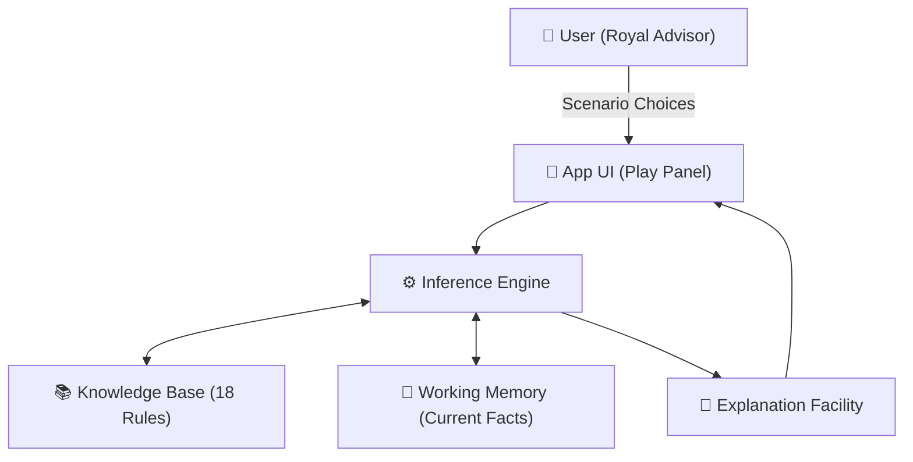
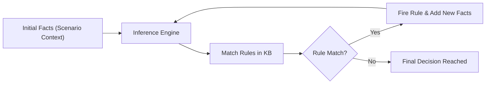

# 👑 Kingdom Advisor — Expert System Game

[](https://opensource.org/licenses/MIT)
[]()
[]()

An interactive, premium web-based **Expert System** game that demonstrates core concepts of **Intelligent Decision Support Systems (IDSS)** through a medieval kingdom management theme.

## 🧠 Core AI Concepts Demonstrated

| Concept | Technical Description |
|---------|-----------------------|
| **Knowledge Base** | A structured repository of **18 IF-THEN production rules** encoding domain expertise. |
| **Inference Engine** | The core reasoning component that matches current "Facts" against rules to derive conclusions. |
| **Forward Chaining** | A **data-driven** reasoning strategy that builds recommendations step-by-step from initial facts. |
| **Explanation Facility** | Provides transparency by tracing exactly which rules fired and why (Explainable AI). |
| **Working Memory** | Temporary storage for facts established during a session. |

---

## 🏗️ System Architecture

The following diagram visualizes the structural components of the Expert System and how they interact:



### 🔗 Forward Chaining Process

The engine uses a data-driven approach, following this logic flow:



---

## 🎮 Game Experience

As the **Royal Advisor**, you must navigate the kingdom through challenges in four domains:
1.  **⚔️ Military**: Managing enemy threats and border defenses.
2.  **💰 Economy**: Handling the treasury, trade, and famine.
3.  **🤝 Diplomacy**: Navigating marriage alliances and peace treaties.
4.  **👨‍👩‍👧‍👦 People**: Addressing morale, plague, and rebellion.

Every decision you make is compared against the **Expert System's recommendation**, and the "Explainable AI" facility will show you the exact reasoning trace behind the best path.

---

## 📂 Project Structure

```
expert-system-game/
├── index.html      # Entire application (single-file architecture)
├── LICENSE         # MIT Open-source license
├── package.json    # Project metadata
├── vercel.json     # Vercel deployment configuration
└── README.md       # Comprehensive documentation
```

---

## 🚀 Getting Started

### Local Development
1. Clone this repository.
2. Run a local server:
   ```bash
   npx serve .
   ```
3. Open `http://localhost:3000` in your browser.

### Deploy to Vercel (Free)
1. **Push** this repo to your GitHub account.
2. Visit [Vercel](https://vercel.com) and **Import** your repository.
3. Select **Other** as the framework and click **Deploy**.

---

## 🎓 Academic Purpose
This project was built to demonstrate the practical application of **Rule-Based Reasoning** in modern software. It serves as a visual and interactive laboratory for students of **AI** and **Decision Support Systems**.

---

## 📄 License
Distributed under the **MIT License**. See `LICENSE` for more information.

*Built with ❤️ using Vanilla HTML/CSS/JS*
