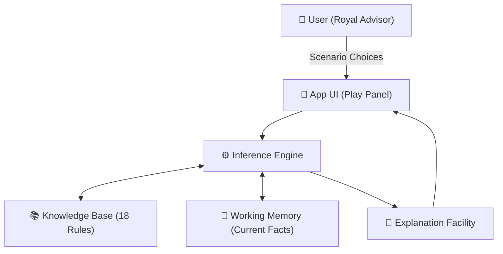
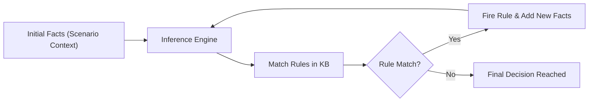

# 👑 Kingdom Advisor — Expert System Game


<div align="center">

[](https://opensource.org/licenses/MIT)
[]()
[]()
[](https://kingdom-advisor-expert-system-game.vercel.app/)

### [🚀 Play the Live Demo Here](https://kingdom-advisor-expert-system-game.vercel.app/)

</div>

---

## 📖 Introduction
**Kingdom Advisor** is a premium, interactive **Expert System** game designed to demonstrate how artificial intelligence supports complex decision-making. Set in a rich medieval world, the game utilizes a robust rule-based engine to provide real-time strategic counsel to a monarch.

This project serves as a showcase for core concepts in **Intelligent Decision Support Systems (IDSS)**, including knowledge representation, forward chaining inference, and explainable AI.

---

## ✨ Key Features

*   **📚 Deep Knowledge Base**: Features **18+ high-fidelity production rules** covering Military, Economy, Diplomacy, and Civil Morale.
*   **⚙️ Data-Driven Engine**: Implements a pure JavaScript **Inference Engine** using **Forward Chaining** to process kingdom facts.
*   **🔗 Transparent Reasoning**: The **Explanation Facility** provides an interactive trace of the reasoning chain for every decision.
*   **⚖️ Conflict Resolution**: Handles multi-condition scenarios with built-in specificity and priority logic.
*   **🎨 Premium UI/UX**: A modern, responsive interface featuring cinematic visuals, glassmorphism, and smooth transitions.

---

## 🏗️ System Architecture

The following diagram visualizes the structural components of the Expert System and how they interact:



### 🔗 The Forward Chaining Logic

The engine follows a standard data-driven flow to derive recommended actions from initial conditions:



---

## 📂 Project Structure

```
expert-system-game/
├── kingdom_advisor_banner.png  # Cinematic branding banner
├── index.html                  # Entire application logic & UI
├── LICENSE                     # MIT Open-source license
├── package.json                # Project metadata
├── vercel.json                 # Vercel deployment configuration
└── README.md                   # Professional documentation
```

---

## 🚀 Installation & Deployment

### Local Development
1. Clone the repository:
   ```bash
   git clone https://github.com/A7med580/Kingdom-Advisor-Expert-System-Game.git
   ```
2. Serve the directory:
   ```bash
   npx serve .
   ```
3. Open `http://localhost:3000`.

### Deploy to Vercel (Free)
This project is optimized for **Vercel**. Simply push to GitHub and import the repository into the Vercel dashboard.

---

## 🎓 Academic Foundation
Built for the **Intelligent Decision Support Systems** curriculum to illustrate how rule-based AI can automate domain expertise through structured logic.

---

## 📄 License
The **Kingdom Advisor** project is released under the **MIT License**. See [LICENSE](LICENSE) for details.

*Built with ❤️ for AI Education*
